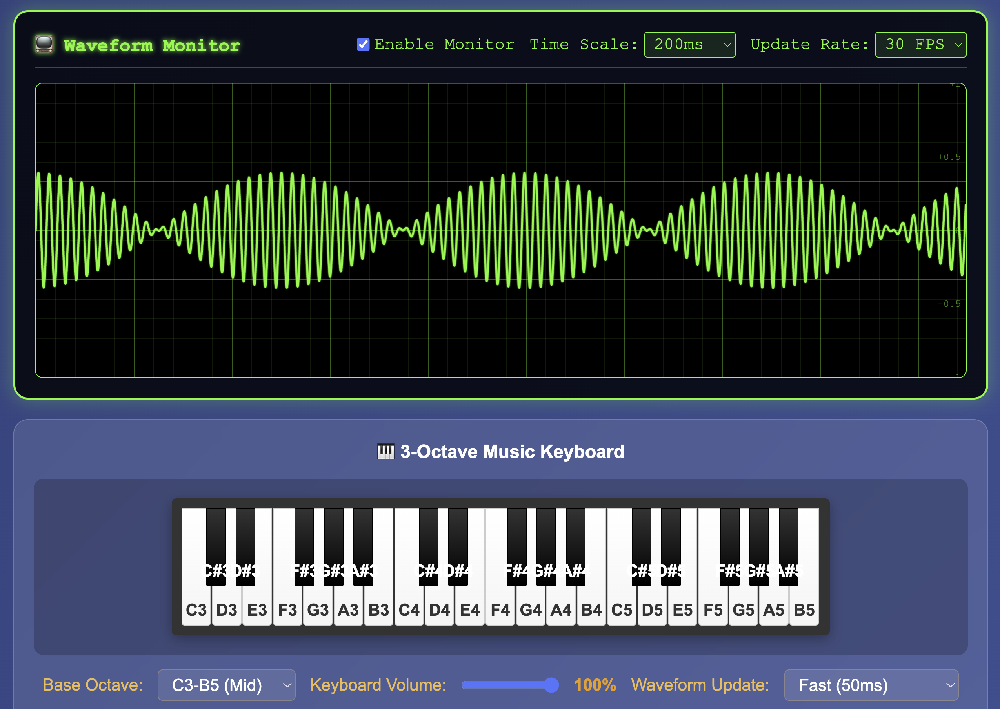

# Audio Frequency Beats

A web-based educational audio frequency mixer to help people understand how fundamental frequencies work with harmony and how beat effects occur when frequencies interact.



## Educational Purpose

This application was created to make acoustic phenomena more accessible and understandable:

- **Fundamental Frequencies & Harmony**: Explore how different frequencies combine to create harmonious or dissonant sounds
- **Beat Effects**: Experience the fascinating acoustic phenomenon where two close frequencies create a rhythmic pulsing effect
- **Frequency Relationships**: Understand how small frequency differences (like 440Hz vs 434Hz) create audible beating patterns
- **Wave Interference**: Visualize how sound waves interact constructively and destructively

By providing real-time audio synthesis and waveform visualization, this tool helps bridge the gap between theoretical acoustics and practical understanding.

## Features

- **3 Oscillators**: Each with independent controls for:
  - Frequency (20Hz - 2000Hz) 
  - Wave type (Sine, Triangle, Sawtooth, Square)
  - Volume (0-100%)
  - Enable/Disable toggle

- **Real-time Visualization**:
  - Mixed waveform display
  - Frequency spectrum analysis
  - Interactive charts using Chart.js

- **Audio Playback**: 
  - Web Audio API integration for real audio preview
  - 2-second audio samples

- **Modern UI**:
  - Responsive design
  - Glass-morphism styling
  - Real-time parameter updates

## Installation

1. Clone or download this project
2. Create a Python virtual environment (recommended):
   ```bash
   python -m venv venv
   ```
3. Activate the virtual environment:
   - On macOS/Linux:
     ```bash
     source venv/bin/activate
     ```
   - On Windows:
     ```bash
     venv\Scripts\activate
     ```
4. Install Python dependencies:
   ```bash
   pip install -r requirements.txt
   ```

## Usage

1. Start the Flask server:
   ```bash
   python app.py
   ```

2. Open your web browser and navigate to:
   ```
   http://localhost:5000
   ```

3. Use the interface to:
   - Adjust frequency sliders for each oscillator
   - Select different wave types from dropdowns
   - Control individual volumes
   - Enable/disable oscillators with checkboxes
   - Click "Generate Audio Preview" to hear the mixed result

## Technical Details

### Backend (Python/Flask)
- **AudioSynthesizer Class**: Generates waveforms using NumPy
- **Wave Generation**: Mathematical functions for sine, triangle, sawtooth, and square waves
- **Wave Mixing**: Combines multiple oscillators with proper normalization
- **FFT Analysis**: Frequency spectrum computation for visualization

### Frontend (HTML/CSS/JavaScript)
- **Chart.js**: Real-time waveform and spectrum visualization
- **Web Audio API**: Browser-based audio synthesis and playback
- **Responsive Design**: Works on desktop and mobile devices
- **Real-time Updates**: Immediate visual feedback as parameters change

### API Endpoints
- `GET /`: Main application interface
- `POST /synthesize`: Generate mixed waveform data
- `POST /generate_spectrum`: Compute frequency spectrum

## Browser Compatibility

- Chrome/Edge (recommended)
- Firefox
- Safari
- Requires modern browser with Web Audio API support

## File Structure

```
FrequencyMatching/
├── app.py                 # Flask application
├── requirements.txt       # Python dependencies
├── README.md             # This file
└── templates/
    └── index.html        # Main HTML interface
```

## Customization

You can modify the following parameters in `app.py`:
- `sample_rate`: Audio sample rate (default: 44100 Hz)
- `duration`: Waveform duration for visualization
- Frequency ranges and default values
- Wave generation algorithms

## Future Enhancements

- Audio recording and export
- Additional waveform types
- Effects (reverb, delay, filters)
- MIDI keyboard support
- Preset saving/loading
